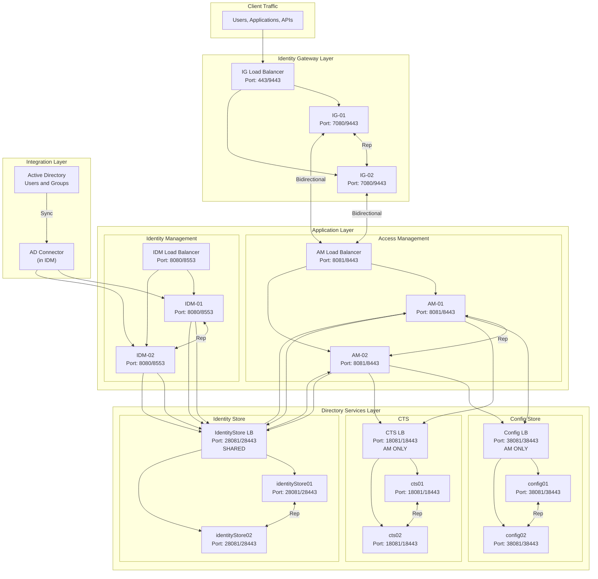

# Platform 8 Architecture Diagram for Confluence

## Option 1: Mermaid Diagram (Native Confluence Support)

Confluence supports Mermaid diagrams natively. Use the following code in a Mermaid macro:



## Option 2: Draw.io XML (Can be imported to Gliffy)

See `architecture-diagram.drawio` file for the complete draw.io XML format.

## Option 3: Gliffy Instructions

To create this diagram in Gliffy:

1. **Open Gliffy in Confluence:**
   - Click "Insert" → "Gliffy Diagram"
   - Or use `/gliffy` command

2. **Create Layers (from top to bottom):**
   
   **Layer 1: Client Traffic**
   - Add a rectangle: "Users, Applications, APIs"
   
   **Layer 2: Identity Gateway**
   - Add a rounded rectangle: "IG Load Balancer"
   - Add two rectangles: "IG-01" and "IG-02"
   - Connect: LB → IG-01, LB → IG-02
   - Add bidirectional arrow between IG-01 ↔ IG-02 (label: "Rep")
   
   **Layer 3: Application Layer**
   - **AM Section:**
     - Add rounded rectangle: "AM Load Balancer"
     - Add two rectangles: "AM-01" and "AM-02"
     - Connect: AM LB → AM-01, AM LB → AM-02
     - Add bidirectional arrow: AM-01 ↔ AM-02 (label: "Rep")
   - **IDM Section:**
     - Add rounded rectangle: "IDM Load Balancer"
     - Add two rectangles: "IDM-01" and "IDM-02"
     - Connect: IDM LB → IDM-01, IDM LB → IDM-02
     - Add bidirectional arrow: IDM-01 ↔ IDM-02 (label: "Rep")
   
   **Layer 4: Directory Services**
   - **Config Store:**
     - Add rounded rectangle: "Config LB (AM ONLY)"
     - Add two rectangles: "config01" and "config02"
     - Connect: Config LB → config01, Config LB → config02
     - Add bidirectional arrow: config01 ↔ config02 (label: "Rep")
   - **CTS:**
     - Add rounded rectangle: "CTS LB (AM ONLY)"
     - Add two rectangles: "cts01" and "cts02"
     - Connect: CTS LB → cts01, CTS LB → cts02
     - Add bidirectional arrow: cts01 ↔ cts02 (label: "Rep")
   - **Identity Store:**
     - Add rounded rectangle: "IdentityStore LB (SHARED)"
     - Add two rectangles: "identityStore01" and "identityStore02"
     - Connect: IdentityStore LB → identityStore01, IdentityStore LB → identityStore02
     - Add bidirectional arrow: identityStore01 ↔ identityStore02 (label: "Rep")
   
   **Layer 5: Integration**
   - Add rectangle: "Active Directory (Users and Groups)"
   - Add rectangle: "AD Connector (in IDM)"

3. **Add Connections:**
   - Client → IG Load Balancer
   - IG-01 ↔ AM Load Balancer (bidirectional, label: "Bidirectional")
   - IG-02 ↔ AM Load Balancer (bidirectional, label: "Bidirectional")
   - AM-01 → Config LB, AM-02 → Config LB
   - AM-01 → CTS LB, AM-02 → CTS LB
   - AM-01 → IdentityStore LB, AM-02 → IdentityStore LB
   - IDM-01 → IdentityStore LB, IDM-02 → IdentityStore LB
   - AD → AD Connector → IDM-01, IDM-02
   - IdentityStore LB → AM-01, AM-02

4. **Color Coding:**
   - IG: Red/Pink
   - AM: Blue
   - IDM: Green
   - DS: Orange
   - IdentityStore (Shared): Purple
   - AD: Gray

5. **Add Labels:**
   - Port numbers on each component
   - "AM ONLY" on Config and CTS
   - "SHARED" on IdentityStore
   - "Rep" on replication arrows
   - "Bidirectional" on IG ↔ AM connections

## Connection Summary Box

Add a text box at the bottom with:

```
Connection Summary:
• IG LB (IG-01, IG-02) ◄───► AM LB (AM-01, AM-02) - Bidirectional
• AM → Config LB → config01, config02
• AM → CTS LB → cts01, cts02
• AM → IdentityStore LB → identityStore01, identityStore02 (reads)
• IDM → IdentityStore LB → identityStore01, identityStore02 (writes) - SHARED
• IDM → AD Connector → AD (users and groups)
• AM and IDM: NO direct connection (communicate via IdentityStore)
```

